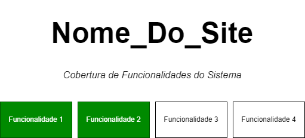

# Automação de testes do Site **Nome_do_Site** com Cypress e Cucumber

---
## Cobertura de Funcionalidades
O objetivo desta seção é evidenciar o **mapeamento de funcionalidades cobertas pelos testes sistêmicos.**

> **Mantenha este diagrama atualizado!**



---

## Configurações
O objetivo desta seção é evidenciar as ferramentas necessárias para execução do projeto.

**Requerimentos**
- [Node.js]
- [Visual Studio Code].

### Visual Studio Code - Extensões Recomendadas

- [Cucumber (Gherkin) Full Support]
  - fornece suporte avançado da linguagem Gherkin no VS Code
- [Cuke Step Definition Generator]
  - habilita a geração automática de steps
- [Specflow Tools]
  - fornece suporte complementar da linguagem Gherkin no VS Code
- [Editor config]
  - padronização de código para todos os colaboradores.
- [Draw.io Integration]
  - manutenção do diagrama correspondente a cobertura de funcionalidades (`doc/module_coverage.drawio`) da aplicação.

---
## Executando Testes
O objetivo desta seção é mostrar como executar os testes.

- Instale as dependências do projeto:
```
$ npm install
```

- Execute todos os testes, via terminal:
```
$ npx cypress run
```

- Execute os testes via interface:
```
$ npx cypress open
```
---

## Padronização de Código

Para padronização de código, usamos o [standardjs].

1. Instale o `standard` em sua máquina: `npm install -g standard`
2. Execute ao final do desenvolvimento para o projeto: `standard cypress/`
3. Revise os ajustes pontuados pela ferramenta, e corrija
4. Se preferir que a própria ferramenta ajuste, execute: `standard cypress/ --fix`

Confira os detalhes das regras e comandos na documentação.

## Acordos de trabalho

  - Branches podem seguir o padrão: feature-test/{id_datarefa}{nome.sobrenome} 
    - ex: feature-test/12345_felipe.nascimento
  - Ao concluir o desenvolvimento em uma feature-test, abrir PR para a develop
  - Todos revisam o código de todos

## Checklist para CodeReview (v1)

  - Requisitos
    - [ ] O objetivo da tarefa foi atingido?
  - Padronização
    - [ ] O código está formatado de acordo com o padrão (standard)?
    - [ ] Tem alguma importação não utilizada que pode ser removida?
    - [ ] Tem algum arquivo não utilizado que pode ser removido?
  - Manutenibilidade
    - [ ] O código está fácil de ler e entender?
    - [ ] O código está sem duplicações desnecessárias?
  - Documentação
    - [ ] O README está atualizado?
---    

[Cypress]: https://www.cypress.io/

[Cucumber]: https://cucumber.io/

[Cypress-Cucumber-Preprocessor]: https://www.npmjs.com/package/@badeball/cypress-cucumber-preprocessor

[Node.js]: https://nodejs.org/en/

[Visual Studio Code]: https://code.visualstudio.com/

[Cucumber (Gherkin) Full Support]: https://marketplace.visualstudio.com/items?itemName=alexkrechik.cucumberautocomplete

[Cuke Step Definition Generator]: https://marketplace.visualstudio.com/items?itemName=muralidharan92.cuke-step-definition-generator

[Editor config]: https://editorconfig.org/

[Specflow Tools]: https://marketplace.visualstudio.com/items?itemName=amillard98.specflow-tools

[Draw.io Integration]: https://marketplace.visualstudio.com/items?itemName=hediet.vscode-drawio

[standardjs]: https://standardjs.com/